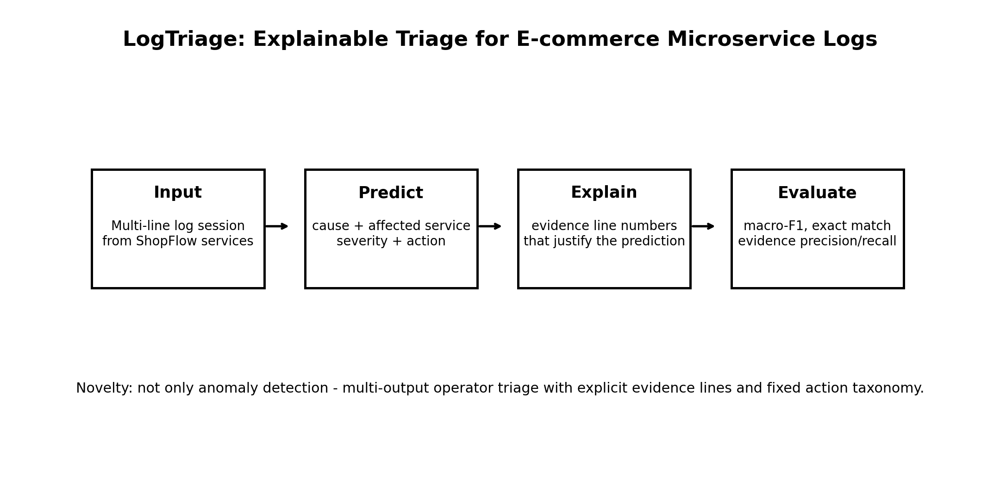

# LogTriage: Explainable Multi-Output Triage for E-Commerce Microservice Logs

NLP course project — synthetic log sessions → structured triage JSON (failure cause, affected service, severity, recommended action, evidence lines). Compares classical baselines, LLM prompting, and a fine-tuned DistilRoBERTa encoder.

## Visual Abstract



## Motivation

In an e-commerce microservice system, checkout failures produce logs across many services. Engineers need to quickly identify the failure cause, affected service, severity, recommended action, and supporting evidence — not just detect that something went wrong.

## Problem Statement

**Input:** numbered multi-line microservice log session (plain text).

**Output:** structured triage JSON:

```json
{
  "failure_cause": "payment_gateway_timeout",
  "affected_service": "payment-service",
  "severity": "high",
  "recommended_action": "check_payment_gateway_and_retry",
  "evidence_lines": [4, 5, 6]
}
```

**Task type:** multi-label structured classification with explainability (evidence-line selection).

## Team Members

| Name | Role |
|------|------|
| Or Zuka | Author |

## Datasets

| Split | File | Examples |
|-------|------|----------|
| Train | `data/logtriage_train.jsonl` | 3,500 |
| Validation | `data/logtriage_valid.jsonl` | 750 |
| Test | `data/logtriage_test.jsonl` | 750 |
| All | `data/logtriage_all.jsonl` | 5,000 |

**Label taxonomy** (`data/label_taxonomy.json`):

| Field | Count | Notes |
|-------|-------|-------|
| Failure causes | 10 | Fixed labels (e.g. `payment_gateway_timeout`) |
| Affected services | 12 in taxonomy | 7 services appear in the generated data |
| Severity levels | 4 | low, medium, high, critical |
| Recommended actions | 10 | Paired with failure causes |

**Session statistics:** average ~7.67 log lines; noise levels low / medium / high; 0 validation issues across all splits.

**Sample I/O:** see `data/sample_examples.json`.

## Synthetic Data Generation

The dataset was generated with LLM-assisted prompts controlling failure cause, affected service, severity, recommended action, noise level, log length, log style, and evidence lines. Design goals: avoid trivial label leakage, preserve incident sequence realism, and create diverse variants.

Prompt templates:

- `prompts/generation_prompt.txt`
- `prompts/validation_prompt.txt`
- `prompts/zero_shot_prompt.txt`
- `prompts/few_shot_prompt.txt`

**Validation** (`src/validate_data.py`) checks schema, taxonomy labels, label coverage, cause–action consistency, evidence-line references, duplicates, and noise distribution.

> `src/generate_data.py` is a stub; the pre-generated JSONL files in `data/` are the canonical dataset for reproducible experiments.

## Models and Pipelines

| # | Model | Type | Script |
|---|-------|------|--------|
| 1 | Majority | Off-the-shelf baseline | `src/train_baselines.py` |
| 2 | Rules | Off-the-shelf baseline | `src/train_baselines.py` |
| 3 | TF-IDF + Logistic Regression | Classical ML | `src/train_baselines.py` |
| 4 | TF-IDF + Linear SVM | Classical ML | `src/train_baselines.py` |
| 5 | TF-IDF + Naive Bayes | Classical ML | `src/train_baselines.py` |
| 6 | Char TF-IDF + SVM | Classical ML | `src/train_baselines.py` |
| 7 | LLM zero-shot | Off-the-shelf (GPT) | `src/run_llm_baseline.py` |
| 8 | LLM few-shot | Prompted (GPT) | `src/run_llm_baseline.py` |
| 9 | DistilRoBERTa | Fine-tuned transformer | `src/train_transformer.py` |

**Pipeline overview:**

1. Load train/valid/test JSONL → concatenate log lines to session text.
2. Train one classifier per output field (cause, service, severity, action).
3. Evaluate per-field accuracy / macro-F1, full exact match, and evidence-line F1.
4. Write predictions, metrics CSV, confusion matrices, and markdown reports.

## Setup

```bash
pip install -r requirements.txt
```

For LLM baselines, create `.env` from `.env.example`:

```bash
OPENAI_API_KEY=sk-your-key-here
```

## Reproducing Experiments

### 1. Validate data

```bash
python src/validate_data.py data/logtriage_train.jsonl
python src/validate_data.py data/logtriage_valid.jsonl
python src/validate_data.py data/logtriage_test.jsonl
```

### 2. Local baselines (full test set, n=750)

```bash
python src/train_baselines.py
```

Metrics and charts are written to `results/` and `visuals/` by the training script.

### 3. LLM baselines (requires API key)

```bash
python src/run_llm_baseline.py --mode zero-shot --limit 30
python src/run_llm_baseline.py --mode few-shot --shots 4 --limit 30
```

Use `--limit 0` for the full 750-example test set (higher API cost).

### 4. DistilRoBERTa fine-tuning (CPU-friendly subset)

```bash
python src/train_transformer.py --model distilroberta-base --train-limit 300 --test-limit 75 --epochs 2
```

## Training Parameters

### Local baselines

| Setting | Value |
|---------|-------|
| Features | Word bigram TF-IDF (max 20k) or char 3–4 gram TF-IDF |
| Classifier | LogReg (OvR), Linear SVM, Multinomial NB, SGD hinge |
| Train / test | 3,500 / 750 |
| Evidence lines | Shared heuristic (not learned) |

### LLM baselines (executed run)

| Setting | Value |
|---------|-------|
| Model | `gpt-4o-mini` |
| Temperature | 0.0 |
| Test subset | n=30 (of 750) |
| Few-shot examples | 4 from training set |

### DistilRoBERTa (executed run)

| Setting | Value |
|---------|-------|
| Model | `distilroberta-base` |
| Device | CPU |
| Train / valid / test | 300 / 60 / 75 |
| Epochs | 2 |
| Batch size | 8 |
| Max sequence length | 256 |
| Heads | One classifier per output field |

## Evaluation Metrics

**Per field:** accuracy and macro-F1 for `failure_cause`, `affected_service`, `severity`, `recommended_action`.

**Structured task:**

- **Full exact match** — all four main labels correct on one example.
- **Evidence-line F1** — precision / recall / F1 on predicted vs. gold evidence indices (heuristic baseline for non-LLM models).
- **Valid JSON rate** — fraction of parseable LLM outputs.

## Results Summary

> **Important:** baseline models use the **full test set (n=750)**. LLM and transformer runs use **smaller subsets** due to API cost and CPU time. Compare models within the same evaluation size.

### Local baselines (test n=750)

| Model | Cause F1 | Service F1 | Severity F1 | Action F1 | Full Exact | Evidence F1 |
|-------|----------|------------|-------------|-----------|------------|-------------|
| Majority | 0.02 | 0.07 | 0.15 | 0.02 | 0.0% | 0.82 |
| Rules | 0.80 | 0.25 | 0.48 | 0.80 | 17.5% | 0.86 |
| TF-IDF LogReg | 1.00 | 1.00 | 0.58 | 1.00 | 54.4% | 0.89 |
| **TF-IDF SVM** | **1.00** | **1.00** | **0.65** | **1.00** | **57.2%** | **0.89** |
| TF-IDF NB | 1.00 | 1.00 | 0.42 | 1.00 | 49.2% | 0.89 |
| Char SVM | 1.00 | 1.00 | 0.61 | 1.00 | 55.2% | 0.89 |

**Best full exact match (baselines):** TF-IDF SVM at 57.2%. **Hardest field:** severity (best macro-F1 ~0.65).

### LLM baselines (test n=30)

| Model | Cause F1 | Service F1 | Severity F1 | Action F1 | Full Exact | Valid JSON |
|-------|----------|------------|-------------|-----------|------------|------------|
| LLM zero-shot | 1.00 | 0.73 | 0.44 | 1.00 | 30.0% | 100% |
| LLM few-shot | 1.00 | 1.00 | 0.64 | 1.00 | 53.3% | 100% |

### DistilRoBERTa (test n=75, CPU subset)

| Model | Cause F1 | Service F1 | Severity F1 | Action F1 | Full Exact | Evidence F1 |
|-------|----------|------------|-------------|-----------|------------|-------------|
| DistilRoBERTa | 0.79 | 0.18 | 0.13 | 0.75 | 8.0% | 0.87 |

Full tables and analysis:

- [`docs/Model_Evaluation_Report.md`](docs/Model_Evaluation_Report.md)
- [`docs/LLM_Evaluation_Report.md`](docs/LLM_Evaluation_Report.md)
- [`docs/Transformer_Evaluation_Report.md`](docs/Transformer_Evaluation_Report.md)

## Presentation

| File | Description |
|------|-------------|
| `slides/LogTriage_Proposal.pptx` | Initial proposal |
| `slides/pdf/LogTriage_Proposal.pdf` | PDF export of proposal |
| `slides/LogTriage_Interim.pptx` | Interim presentation |
| `slides/pdf/LogTriage_Interim.pdf` | PDF export of interim deck |
| `slides/LogTriage_Final.pptx` | Final deck (all models) |
| `slides/pdf/LogTriage_Final.pdf` | PDF export of final deck |

## Repository Structure

```
logtriage-nlp-project/
├── data/                  # Synthetic JSONL splits + taxonomy
├── docs/                  # Evaluation reports (baseline, LLM, transformer)
├── models/                # Saved sklearn + transformer checkpoints
├── notebooks/             # Exploratory notebooks (placeholders)
├── prompts/               # LLM prompt templates
├── results/               # Metrics CSV, predictions JSONL, confusion matrices
├── slides/                # PPT and PDF presentations
├── src/                   # Training, evaluation, and validation scripts
├── visuals/               # Charts and visual abstract
├── .env.example           # API key template
├── requirements.txt
└── README.md
```

### Key scripts

| Script | Purpose |
|--------|---------|
| `src/train_baselines.py` | Train and evaluate 6 local baselines |
| `src/run_llm_baseline.py` | Zero-shot / few-shot LLM evaluation |
| `src/train_transformer.py` | Fine-tune DistilRoBERTa per field |
| `src/validate_data.py` | Dataset schema and taxonomy validation |
| `src/evaluate.py` | Shared evaluation utilities |

## Limitations

- Synthetic logs may not match production log distributions.
- Strong lexical cues in synthetic data inflate TF-IDF scores.
- Severity is context-dependent and remains the hardest field.
- Evidence-line scoring uses a shared heuristic unless a dedicated evidence model is trained.
- LLM and transformer results use smaller test subsets than local baselines.
- DistilRoBERTa was trained on CPU with limited data (proof-of-concept, not full fine-tune).
